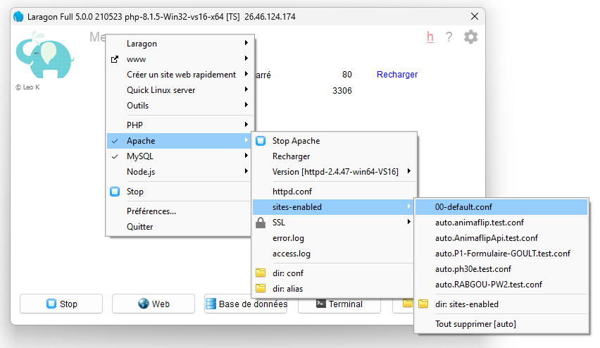

# Introduction 
TODO: Give a short introduction of your project. Let this section explain the objectives or the motivation behind this project. 

# Getting Started
TODO: Guide users through getting your code up and running on their own system. In this section you can talk about:
1.	Installation process
2.	Software dependencies
3.	Latest releases
4.	API references

# Build and Test
TODO: Describe and show how to build your code and run the tests. 

# Laragon
Une fois le repo cloné, ouvrir le '00-default.conf' d'Apache pour y créer le virtual host :


```
<VirtualHost _default_:80>
    DocumentRoot "yourdirectory\Animaflip\AnimaflipApi\public"
    <Directory "yourdirectory\Animaflip\AnimaflipApi\public">
        AllowOverride All
        Require all granted
    </Directory>
</VirtualHost>
```

Puis créer la base de donnée ``animaflip``